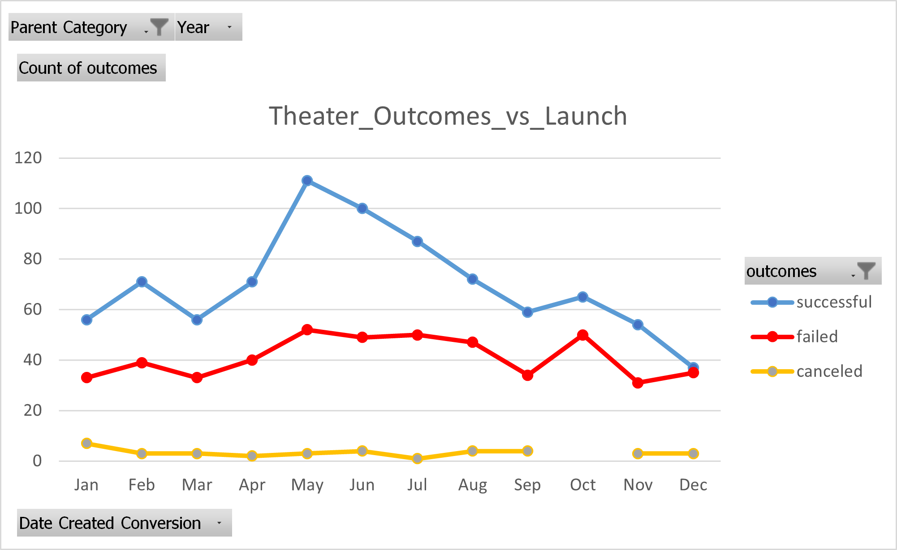
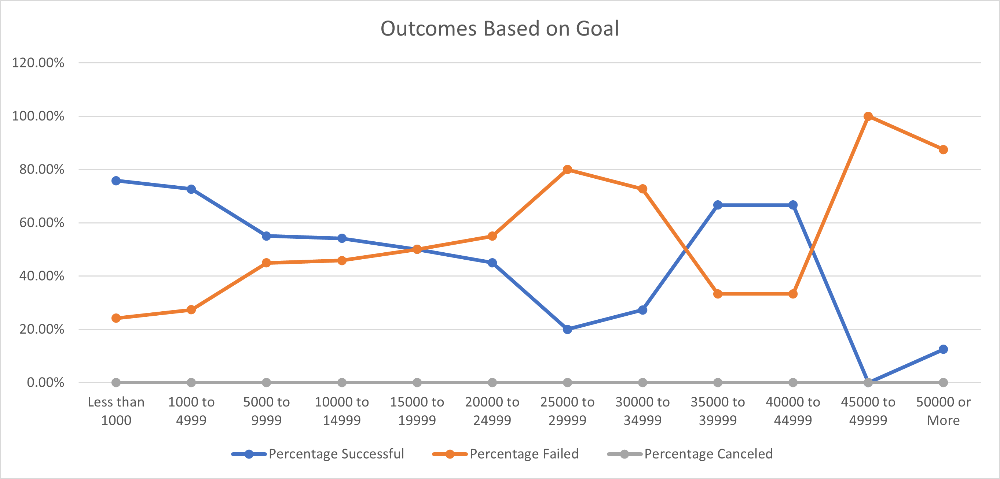

# Kickstarter-analysis
# Kickstarting with Excel

## Overview of Project
Louise's fundraising goal for her play, Fever, came to close quickly and now she is curious to see how her campaign is compared to others and if there is any correlation to *launch date* and *funding goals*
### Purpose
Goal of this project is to figure out how different campaigns fared  based on their *launch date* and *funding goals*
## Analysis and Challenges
### Analysis of Outcomes Based on Launch Date
Starting from a fresh dataset, I updated some of the columns to match their inputs. Then unix time converted to a human readable unit and subsequently the year was extracted. Parent category and Subcategory columns created next. 
A pivot table was created with date in rows and values in outcome column as the headers for the new table.
A line chart was plotted to show the Theater Outcomes for different months.

### Analysis of Outcomes Based on Goals
A new table created and goal ranges were typed in. I used text to column to separate the lower and uppper limits for each range. Then used COUNTIFS function , which I had to read the documentation online,  to calculate the requested values in each column.
At the end, a line chart was plotted to see the Outcomes based on Goal and it's shown below: 

### Challenges and Difficulties Encountered
There were few challenges/difficulties.
- The first one was inability to sort properly. Everytime I tried to sort the rows, the columns were sorted. I asked a collegue for help and learned that to sort the rows, a single cell needs to be selected and the sort operation will sort all the rows in the same column.
- The second probelm was that the row labels in Theater outcomes by launch date sheet should have been in month. However, the displayed data was by year/month. So I read the documentation online and learned about grouping. 

- During typing the report, there was a difficutly in linking the images. I figured out that if there is space in the naming, then it cannot be linked properly. I renamed the images by replacing space with "_". ( I used visual studio code to preview markdown)

## Results
- **What are two conclusions you can draw about the Outcomes based on Launch Date?**
    - *It looks like campaigns starting in May perfrom better than any other launch date.  Successfulness slowly tapers down towards the end of the year.* 
    - *Number of failed or canceled campaigns realtively stays constant throughout the year. December is the worse month start a campaign*
- **What can you conclude about the Outcomes based on Goals?**
    - *The percentage of successful campaigns decreases asthe fund raising goal rises. (it has a negative trend)*
- **What are some limitations of this dataset?**
    - *one thing that's missing from the dataset is the way the campaigns were run or how each campaign found their backers. Also, it would be nice to have a column as why the failed campaigns didn't perform as expected*
- **What are some other possible tables and/or graphs that we could create?**
    - *it would be interesting to know in which category the pledged amount was higher. In otherwords, in what category people are more willing to pay.*
    - *number of backers vs category and subcategory is also interesting.*
